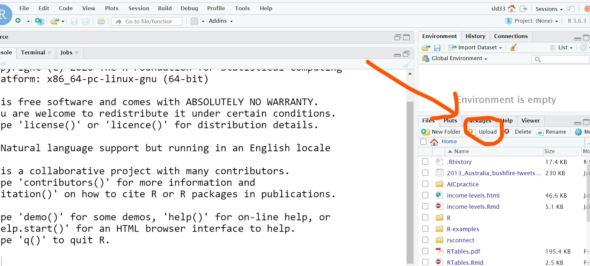

```{r setup, include=FALSE}
library(learnr)
# library(checkr)
# library(statPREP)
library(tidyverse)
library(ggformula)
library(mosaic)
theme_set(theme_bw())
# knitr::opts_chunk$set(exercise.checker = checkr::checkr_tutor)
knitr::opts_chunk$set(
  echo = TRUE,
  fig.align = "center",
  fig.width = 6, fig.height = 2.5)
MI_lead <- read.csv(file='http://sldr.netlify.com/data/MI_lead.csv')
tutorial_options(exercise.eval = FALSE)
```


<style type="text/css">
  span.boxed {
    border:5px solid gray;
    border-radius:10px;
    padding: 5px;
  }
span.invboxed {
  border:5px solid gray;
  padding: 5px;
  border-radius:10px;
  color: white;
}

table, td, th { border:0px; }

/* cellpadding */
  th, td { padding: 5px; }

</style>

## Your Mission
The purpose of this tutorial is to get you familiar with the formula syntax we'll use to specify regression models in R.

But you may have noticed that *you are not even using R.* At least, you haven't logged in to the RStudio server.

This tutorial environment lets you read some helpful information, then practice writing and running your own R code, *without* tabbing back and forth between the tutorial website and RStudio. 

These tutorials can also serve as helpful reference guides later on, if you need reminders or more practice. 

## Communicating with R

### Two Key Questions

To get R (or any software) to do something for you,
there are two important questions you must be able to answer. The answers give R all the information it needs to do your bidding.

Before continuing, think about what those questions might be.
  
### The Questions

To get R (or any software) to do a job for you, there are two
important questions you must be able to answer:
  
#### 1. What do you want the computer to do?
  
#### 2. What must the computer know in order to do that?
  
### Providing R with the information it needs
  
  R *functions* provide R with the answer to the first question: what do you want the computer to do?
  
  Most functions in R have short, but descriptive names that describe what they do.  We'll be using `lm()` today, to fit linear regression models.
  
  But as you already know, just giving R a function is not enough: you also need to answer the second question (what information does R need to do the job?). 
  
  We will provide answers to our two questions by filling in
the boxes of a basic template:
  
  <center>
  <h2><strong><span class="boxed">function</span> ( <span class="boxed">&nbsp;information1&nbsp; , &nbsp;information2&nbsp; , ...)</strong> 
  </h2></center>
  &nbsp;

(The `...` indicates that there may be some additional *input arguments* (input information we could provide to R) we could add
  eventually. Inputs in R are separated by commas.)


### Getting more help
You can get help related to R function, and built-in R datasets, using a special function: `?`.  Just type ? followed by the name of the function or dataset you want help on:

```{r get-help, exercise=TRUE}

```

```{r get-help-hint, results='hide'}
?HELPrct
```

*Note: depending on how you are accessing this tutorial, and perhaps depending on operating system settings and R versions, this may or may not work within the tutorial. If you run it in a "normal" R console, it will open an html help file.*

## Reading in data from a file
As we transition to working with regression models, you will often be asked to analyze data that is stored in files that are available online - usually in csv format. 

We've already done a bit of this, with example code showing how to read in the data, but it may be worth a quick, explicit review.

It's simple to read csv files stored online into R. For example, we can read in the file MI_lead.csv, which is stored at <http://sldr.netlify.com/data/MI_lead.csv>:

```{r}
MI_lead <- read.csv(file = 'http://sldr.netlify.com/data/MI_lead.csv')
```

*Note: for this course and for regression models in particular, `read.csv()` from base R is usually preferred over `read_csv()` from the `readr` package, because of the way that categorical variables are treated by default. However, `read_csv()` is a lot faster for huge datasets.*

### The most common mistakes
The code below contains a couple of the **most common mistakes** students make when they try to read in a data file. See if you can find and correct them.

The code below should read in some baseball statistics from the file <http://sldr.netlify.com/data/baseball.csv>.

```{r baseball-mistakes, exercise = TRUE}
read.csv(file = http://sldr.netlify.com/data/seball)
```

<div id="baseball-mistakes-hint">
**Hints:** Look for typos.  Look for things that are missing - quotation marks, maybe? And finally, remember that you want to assign a **name** to the data once it's read in (not just print to the)
</div>


<!-- <div id="baseball-mistakes-hint-2"> -->
<!-- **Hint:** Compare the URL in the R code with the one in the text above. Can you find any differences? (Typos in URLs are a very common error. Also, if you copy/paste a URL with special characters like quotes and tildes and dashes, they are also sometimes misinterpreted -- you might want to try deleting them and re-typing those particular characters. -->
<!-- </div> -->

<!-- <div id="baseball-mistakes-hint-3"> -->
<!-- **Hint:** Once your code runs, you may notice that it reads in the file and then prints it all to the screen. It would be better to save it as an R object... -->
<!-- </div> -->

<!-- ```{r baseball-mistakes-hint-4} -->
<!-- read.csv(http://sldr.netlify.com/data/baseball) -->
<!-- ``` -->

<!-- ```{r baseball-mistakes-hint-5} -->
<!-- read.csv(http://sldr.netlify.com/data/baseball.csv) -->
<!-- ``` -->

<!-- ```{r baseball-mistakes-hint-6} -->
<!-- read.csv('http://sldr.netlify.com/data/baseball.csv') -->
<!-- ``` -->

<!-- ```{r baseball-mistakes-hint-7} -->
<!--  <- read.csv('http://sldr.netlify.com/data/baseball.csv') -->
<!-- ``` -->

<!-- ```{r baseball-mistakes-hint-8} -->
<!-- baseball <- read.csv('http://sldr.netlify.com/data/baseball.csv') -->
<!-- ``` -->

### What about local files?
The same function, `read.csv()`, can be used to read in a local file.  You just need to change the input to `read.csv()` -- instead of a URL, you provide a path and filename (in quotes).  For example, the input file='http://sldr.netlify.com/data/MI_lead.csv' might become file='C:\\Data\\MI_lead.csv'.

We won't do an example in this tutorial because there isn't a way to work with local files within a tutorial environment, but you can practice it once you are working independently in RStudio.

If you are working on the server rstudio.calvin.edu, you will have to *upload* files to your cloud space on the server before you can read them in (RStudio on the server cannot access files on your computer's hard drive). Use the upload button in the Files tab on the lower right.


```{r, echo = FALSE, out.width='500px', fig.align='center'}

```

### Side note: named input arguments
The input argument we provided to R is the URL (in quotes -- either single or double quotes are fine).  But notice that this time, we gave the input argument a *name*, "file", and specified its value with an equal sign.

This is not *required* - the command works fine without it:

```{r}
MI_lead <- read.csv('http://sldr.netlify.com/data/MI_lead.csv')
```

However, if a function has *more than just one* input argument, it's good to get in the habit of providing names for the inputs.  If you provide names, then the order in which you list the inputs doesn't matter; **without named inputs, the order matters** and you have to use `?` to figure out what order R expects!

### Renaming variables in a dataset

What if we didn't like the names of the `MI_lead` variables?  For example, a new user of the dataset might not know that that ELL stands for "elevated lead levels" and that ELL2005 gives the *proportion* of tested kids who had elevated lead levels in the year 2005.

If we wanted to use a clearer (though longer) variable name, we might prefer "prop_elevated_lead_2005" instead of "ELL2005" -- more letters to type, but a bit easier to understand for a new user.  How can we tell R we want to rename a variable?

We use the code:

```{r, rename-MI_lead, echo=TRUE}
MI_lead <- MI_lead %>%
  rename(prop_elevated_lead_2005 = ELL2005)

glimpse(MI_lead)
```

Translated into words, it tells R:

"Make a dataset called `MI_lead` by starting with the dataset `MI_lead`. Send (%>%) the `MI_lead` dataset to the function rename(). What I want to rename is the variable `ELL2005`. Its new name should be `prop_elevated_lead_2005`."

### Non-standard variable names
It's best practice to avoid using spaces and special characters in variable names for use in R. But you *can* get away with it with some special tricks.

You also need this trick if you get a data file that *has* these non-standard names and you want to change them.

Basically, you enclose the non-standard name in "graves" or "back-ticks" -- the symbol $\grave{}$, found on US keyboards in the upper left corner. Like so:

```{r, eval = FALSE}
mydata <- mydata %>%
  rename(new_variable_name = `bad old variable name`)
```

### Your Turn
It's your turn to practice now. Read in a dataset, `glimpse()` or `head()` to find the names of the variables in it, and change one or two of them to your liking.

If you don't want to use the lead dataset, or want more practice, try:

- <https://sldr.netlify.com/data/elephantSurvey.csv>
- <https://sldr.netlify.com/data/gapminder_clean.csv>
- <https://sldr.netlify.com/data/HaDiveParameters.csv>

```{r look-at-MI_lead, exercise=TRUE}

```

## Review

What previously-implicit things about R have been made explicit so far?  Maybe more than you think!

### Functions in R
You've learned that R code is made up of functions, which are generally named descriptively according to the job they do.  Functions have one or more input arguments, which is where you provide R with all the data and information it needs to do the job.  The syntax for calling a function uses the template:

  <center>
  <h2><strong><span class="boxed">function</span> ( <span class="boxed">&nbsp;information1&nbsp; , &nbsp;information2&nbsp; , ...)</strong> 
  </h2></center>
  &nbsp;
  
  
### Variables in R
You've practiced creating variables in R using `c`, and saving information (or the results of a computation) using the assignment arrow <-.  

### Datasets in R
You've considered several different ways to get datasets to work with in R: you can use datasets that are built in to R or R packages, or you can use `read.csv` to read in data files stored in .csv format.

If you also want to know how to read in data direct from a Google sheet, check out my [R markdown tutorial](https://rsconnect.calvin.edu:3939/content/6/) -- scroll waaaaaay down in the left navigation menu to select the section "Reading data from Google Sheets".

## Model Formula Template
Back to linear regression.

The function we'll use to fit a linear regression is `lm()`.

The first input to `lm()` (and basically all other R functions that fit regression models) is a **model formula** of the form:

&nbsp;
<center>
  <h2><strong><span class="boxed">lm</span> ( <span class="invboxed">&yy</span> ~ <span class="invboxed">&xx</span> , data = <span class="boxed">mydata</span> )</strong> 
  </h2></center>
  
  &nbsp;

  
  How do we fill in the empty boxes?

### Good news: No Quotation Marks
We will need to use variable names from our dataset as part of the information to fill in, of course.  But good news: the variable names never need to be enclosed in quotation marks.

## Model Formula: Left Hand Side
The left hand side of the formula is simplest: we just need to provide the name of the **response variable** that we want to model.

&nbsp;
<center>
  <h2><strong><span class="boxed">lm</span> ( <span class="boxed">&nbsp;Y&nbsp;</span> ~ <span class="invboxed">&xx</span> , data = <span class="boxed">mydata</span> )</strong> 
  </h2></center>
  
  &nbsp;
  
For example, if we use dataset `MI_lead` and our response variable is `ELL2012`, the skeleton of our formula would look like:

```{r, eval = FALSE, echo = TRUE}
my_model <- lm( ELL2012 ~ _______, data = MI_lead)
```

## Model Formula: Right Hand Side
On the other side of the formula (after the tilde symbol $\sim$), we need to specify the names of predictor variables, separated by `+`.

If some predictors are categorical, *no problem*! R will handle the appropriate conversion to indicator variables for you. There is no need to pre-create these yourself; the original categorical variable is fine.

For example, fit a model with a quantitative and a categorical predictor. We can then use `model.matrix()` to see the model matrix **X** that R generated.

```{r}
MI_lead <- read.csv(file='http://sldr.netlify.com/data/MI_lead.csv')
my_model <- lm(ELL2012 ~ ELL2005 + Peninsula, 
               data = MI_lead)
model.matrix(my_model) %>% head()
```

### Practice
Your turn: fit a few linear regression models of your own. You can use the `MI_lead` data, or read in one of the other suggested datasets:

- <https://sldr.netlify.com/data/elephantSurvey.csv>
- <https://sldr.netlify.com/data/gapminder_clean.csv>
- <https://sldr.netlify.com/data/HaDiveParameters.csv>

Make sure to try:

- A model with a single predictor
- A model with at least two predictors
- A model with at least one categorical predictors

Each time, use `model.matrix()` on your fitted model object to see the **X** that R generates for you.

```{r lm-formula-practice, exercise = TRUE}
my_model <- lm(_____ ~ _____, data = ______)
model.matrix(my_model)
```

### What is Constant?
Did you notice one thing the was *exactly the same* in the model matrices **X** for all the models you just fitted?

The *first column* never changed.

```{r b0-quiz}
quiz(question("What does the first column of the model matrix correspond to?",
     answer('The intercept', correct = TRUE),
     answer('The first predictor'),
     answer('The last predictor'),
     answer('The response variable'),
     answer('The residuals'),
     allow_retry = TRUE,
     random_answer_order = TRUE)
)
```

### The constant is...
The intercept is always included in all `lm()` models, by default.

If you wish, you can specifically tell R to include it (which doesn't change the default behavior, but just makes it explicit). You do this by using a right-hand-side formula like `1 + x1 + x2 + .... xp`:

```{r, eval = FALSE, echo = TRUE}
my_model <- lm(ELL2012 ~ 1 + ELL2005, data = MI_lead)
```

### Omitting the Intercept
You can omit estimation of an intercept by replacing that `1` with a `0` or a `-1`. This will force the intercept to be 0 (line goes through the origin).

The 0 makes sense to me, because it's like you're forcing the first column of the model matrix to contain zeros instead of ones, multiplying the intercept by 0 to force it to be 0.

(I'm not sure of the logic of the -1.)

For example,

```{r, echo = TRUE, eval = FALSE}
my_model <- lm(ELL2012 ~ 0 + ELL2005 + Peninsula,
               data = MI_lead)
```

### Last Chance to Practice
Your turn. Try fitting a model with the same response, and the same predictor(s), but using 0, 1, and -1 to specify whether to estimate an intercept.

Check out the model matrix to verify that it comes out as you expect.

If you don't want to use the lead dataset, or want more practice, try:

- <https://sldr.netlify.com/data/elephantSurvey.csv>
- <https://sldr.netlify.com/data/gapminder_clean.csv>
- <https://sldr.netlify.com/data/HaDiveParameters.csv>


```{r intercept-practice, exercise = TRUE}

```

## Inhibition
One last function may come in useful to us in regression model formulas.  `I()` makes R "inhibit interpretation" of whatever it contains.

What does that mean? Well, within a model formula, operations like `+`, `*`, and others have special interpretations. For example, `predictor1 + predictor2` doesn't mean to add the two predictor variable values together arithmatically; it means to treat them both as predictor variables in the regression.

If we want to include *functions of* variables -- like sums, products, squares, etc. -- in a regression equation, we can surround them with `I()`.

For example,

```{r}
model1 <- lm(PropPre1950 ~ ELL2012 + ELL2005, 
             data = MI_lead)
```

fits the model (in slope-intercept form this time)

$$ \text{PropPre1950} = \beta_0 + \beta_1(\text{ELL2012}) + \beta_2(\text{ELL2005}) + \epsilon$$

but

```{r, eval = FALSE, echo = TRUE}
model1 <- lm(PropPre1950 ~ I(ELL2012 + ELL2005), 
             data = MI_lead)
```

fits

$$ \text{PropPre1950} = \beta_0 + \beta_1(\text{ELL2012} + \text{ELL2005}) + \epsilon$$

This trick can come in handy at times, but in practice, it's often more convenient to just create a new variable in your dataset that contains the desired sum, product, squared term, etc., rather than creating it on the fly in the model formula.