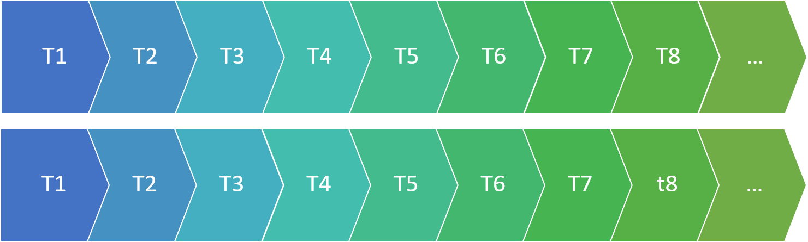
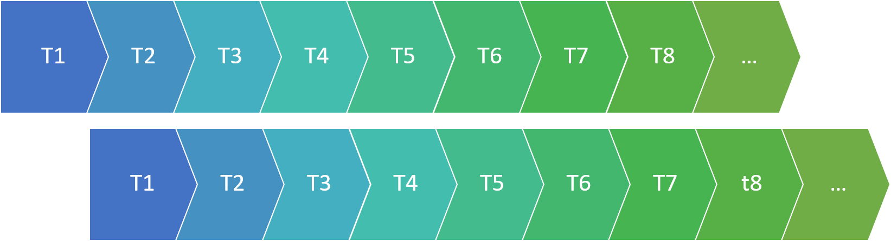
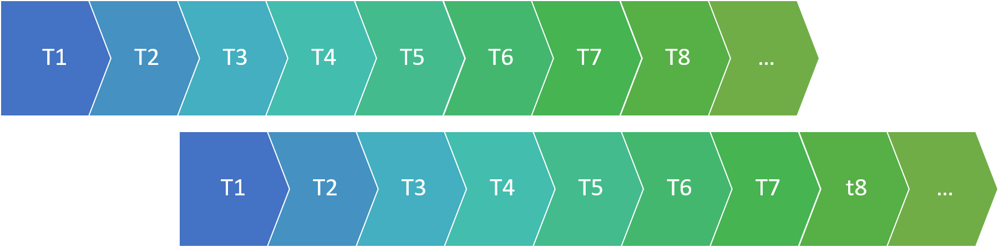

```{r setup, include=FALSE}
library(learnr)
# library(checkr)
# library(statPREP)
library(tibble)
library(ggformula)
library(mosaic)
theme_set(theme_bw())
# knitr::opts_chunk$set(exercise.checker = checkr::checkr_tutor)
knitr::opts_chunk$set(
  echo = TRUE,
  fig.align = "center",
  fig.width = 6, fig.height = 3.5)
lead <- read.csv(file='http://sldr.netlify.com/data/FlintWaterTestJanMar2016.csv')
tutorial_options(exercise.eval = FALSE)
mr1 <- lm(Lead ~ Fluoride + Water_Filter + Month, data=lead)
```

## Fitting a model
To fit a linear regression model in R, we will use the function `lm()`. Let's try an example with the `lead` dataset from (http://sldr.netlify.com/data/FlintWaterTestJanMar2016.csv):

```{r, echo=FALSE}
head(lead)
```

The first input to `lm` is a formula of the form $y \sim x_1 + x_2 + ...$, where y is the name of the response variable, and $x_1$, $x_2$, ... $x_n$ are the predictor or explanatory variables.  The second input to `lm` is `data`, the name of your dataset.

Let's try a model with response varialbe `Lead` and predictors `Fluoride`, `Water_Filter`, and `Month`.

```{r, fit-lm, exercise=TRUE}
mr1 <- lm(y ~ x1 + x2, data=lead)
```

The R code above fits a linear regression model of the form:

$$ y = \beta_0 + \beta_1*x_1 + \beta_2*x_2 + \epsilon,$$
where $\epsilon \sim N(0, \sigma)$. (The residuals $\epsilon$ follow a normal distribution with mean 0 and some standard deviation $\sigma$.)

## Viewing model summary and coefficients
To extract just the *coefficient* or *parameter* values (the "$\beta$s") from the fitted model object `mr1`, we can use  `coef()`:

```{r, get-coef, exercise=TRUE}
coef(mr1)
```

To get a full summary, use `summary()`:
```{r, get-summ, exercise=TRUE}
summary(mr1)
```

Notes about the summary:

- The fitted model parameters are in the "Estimate" column of the coefficient table.
- The last column of the coefficient table contains p-values.  The first row is the p-value for a test of the null hypothesis that the true intercept, $\beta_0$, is 0 (this is not usually of much interest). The second row is the p-value for a test of the hypothesis that $\beta_1$, the slope for the first predictor variable, is 0.  This *is* usually of interest, because it tells us whether there is a "real" linear relationship between the two variables.
- $\hat{\sigma}$ (an estimate of the standard deviation of the residuals from the data) is near the bottom of the output, called "Residual standard error."
- Also near the bottom of the summary output, the $R^2$ value is reported.  (If there are more than one predictors in the model, we prefer to use the adjusted $R^2$ value instead of the standard one.)

If there is only one predictor variable, we can also easily make a scatter plot of the response variable as a function of the predictor variable, with the best-fit line overlaid:

```{r, echo=TRUE}
gf_point(Lead ~ Fluoride, data=lead) %>%
  gf_lm()
```

To include a 95% confidence interval around the line (indicative of our uncertainty about the true values of the slope and intercept), we can add the input `interval='confidence'`:

```{r, echo=TRUE}
gf_point(Lead ~ Fluoride, data=lead) %>%
  gf_lm(interval='confidence')
```

## Regression conditions
For a linear regression model to be appropriate for a dataset, a few conditions have to be met:

0. The data are a representative sample of the population of interest.
1. Linear relationship between each predictor and the response variable (or at least no apparent non-linear relationship).
2. Independence of residuals
3. Normality of residuals
4. Error (residuals) variance is constant (this condition is also known as "homoscedasticity")

## Checking linearity
To verify that the relationship between our predictor variable(s) and our response variable is linear, we can examine a few plots.

First, we can make scatter plots of the response variable as a function of each predictor variable. We want to verify that **there are no apparent non-linear trends** in the plot.

```{r, y-vs-x, exercise=TRUE}
gf_point(Lead ~ Aluminum, data=lead )
```

Next, we can plot the *residuals from the fitted model* as functions of:

- The fitted values (predicted values $\hat{y}$ for each data point in the dataset)
- (Optionally) Each predictor

In these plots, we should see **no** trends -- linear or nonlinear. They should look like relatively random scatter.

We can use the R function `resid()` to get the residuals from the fitted model object, and `fitted()` to get the predictions.

```{r, resid-plots, exercise=TRUE}
mr1 <- lm(y ~ x1 + x2, data=lead)
gf_point(resid(mr1) ~ fitted(mr1))
```

## Checking Independence

Independence of residuals means that knowing the value of one residual does not help you to predict the value of the next residual.

When data are collected over time and space, sometimes the residuals are *not* independent over time (or space) -- for example, maybe series of positive residuals tend to occur together, or series of negative residuals together. How can we detect this kind of non-independence?

First, make sure that your dataset is sorted in order of time (if you are worried about non-independence over time) or space (if you are worried about possible non-independence over space). (The `lead` dataset is already sorted in temporal order - you can verify this by looking at the variable `Decimal_Date`.)

The autocorrelation function will help us.

This function computes a value akin to a correlation coefficient for the dataset, indicating how much it is correlated *with itself* at different "lags".  What does this mean?

Lag 0 is the correlation of the data with itself.

```{r echo = FALSE, fig.align = "center", out.width = "40%"}

```

Of course the correlation at lag 0 is ALWAYS 1: the dataset is identical with itself.

What about larger lags?

To compute the ACF at lag 1, we slide one copy of the dataset forward one observation, and compute the correlation again:

```{r echo = FALSE, fig.align = "center", out.width = "40%"}

```

This tells us how well we can predict one observation in the data, based on the preceding observation.

Lag 2 scoots the data one more position:

```{r echo = FALSE, fig.align = "center", out.width = "40%"}

```

...And so on.

We can plot the ACF for many lags using the function `acf()`.

```{r, make-acf, exercise=TRUE}
acf(resid(mr1))
```

The horizontal dotted lines are approximate 95% confidence boundaries for how large the ACF values (for lags greater than 0) *should* be, if the data are really independent. 

In general, to verify the independence condition of linear regression, we want to confirm that not many of the ACF values for lags greater than 0 exceed those horizontal "fences" by very much. (One or two ACF values that just barely "poke above the fence" is not a major violation.)

In the plot above, all the "spikes" are within the "fences", so there is no indication of non-independence in the residuals.

## Checking Normality of Residuals
To check whether the residuals look like a sample from a normal distribution, look at a histogram:

```{r, rhist, exercise=TRUE}
gf_histogram(~resid(mr1))
```

Note: The distribution doesn't have to look perfectly normal -- it has to look like it might reasonably be a *sample* from a normal.  

## Checking Error Variance
For linear regression to be appropriate for data, there should be homoscedasticity, or constant variance of the residuals.  This means that the spread of the data points around the best-fit line should be constant - the width of the point cloud around the line should not be less in some places, and more in others.  

Or, alternatively (and easier to see visually), the spread of the residuals around a horizontal line at y = 0 on a residuals vs fitted plot should be constant.

```{r, resid-error, exercise=TRUE}
gf_point(resid(mr1) ~ fitted(mr1))
```

If this condition does not hold, the most common pattern to see is a "trumpet" shape like the one above, where the residuals become more spread out for larger fitted values.  However, any non-constant spread is a cause for concern.

### Variable by Variable
It is also a good idea to plot residuals as a function of each predictor.  Constant variance should hold here just as it does when plotting as a function of fitted value.

```{r, resid-error-vs-pred, exercise=TRUE}
gf_point(resid(mr1) ~ Water_Filter,
         data = lead)
```