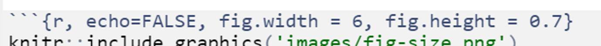

  
```{r setup, include=FALSE}
library(learnr)
# library(checkr)
# library(statPREP)
library(tibble)
library(ggformula)
library(ggthemes)
library(mosaic)
library(NHANES)
theme_set(theme_bw())
# data(Births78, package = "mosaicData")
# Births78 <- Births78 %>% mutate(date = as.Date(date))
data(Births, package = "mosaicData")
data(NHANES, package = "NHANES")
for (y in unique(Births$year)) {
  assign(paste0("Births",y),  Births %>%
           dplyr::filter(year == y))
}
Births1978 <- Births %>% 
  dplyr::filter(year == 1978)
data(Galton, package = "mosaicData")
# knitr::opts_chunk$set(exercise.checker = checkr::checkr_tutor)
D <- data.frame(
  group = LETTERS[1:3],
  count = c(20, 25, 18)
)
knitr::opts_chunk$set(
  echo = FALSE,
  fig.align = "center",
  fig.width = 6, fig.height = 2.5)
```


<style type="text/css">
  span.boxed {
    border:5px solid gray;
    border-radius:10px;
    padding: 5px;
  }
span.invboxed {
  border:5px solid gray;
  padding: 5px;
  border-radius:10px;
  color: white;
}

table, td, th { border:0px; }

/* cellpadding */
  th, td { padding: 5px; }

</style>
  
## Acknowledgements
This tutorial was created based closely on the "Introduction" tutorial provided with the `ggformula` package. If desired you can access the original tutorial by running the code below in RStudio.

### Note: Do NOT actually switch to R and run the code below...
unless you want to view the original tutorial!  Instead, click "Next Topic" below to continue with *this* tutorial...

```{r, echo=TRUE, eval=FALSE}
library(ggformula)
library(learnr)
learnr::run_tutorial("introduction", package = "ggformula")
```
  
  
## US Births in 1978

The plot below shows the number of live births in the United
States each day of 1978.  We are going to use it to learn how to create
plots using the `ggformula` package.

```{r, echo = FALSE}
gf_point(births ~ date, data = Births1978)
```

But before we do that, take a look at the plot.

  1. What patterns do you see in the plot?
  
  2. Can you conjecture reasons for those patterns?
  
  3. How might we improve the plot to test your conjectures?
  
## Scatter plots with ggformula

### Two important questions

To get R (or any software) to create this plot (or do anything else, really),
there are two important questions you must be able to answer.  Before
continuing, see if you can figure out what they are.

### The Questions

To get R (or any software) to create this plot, there are two
important questions you must be able to answer:
  
#### 1. What do you want the computer to do?
  
#### 2. What must the computer know in order to do that?
  
### Answers to the questions
  
To make this plot, the answers to our questions are 

#### 1. What do you want the computer to do?

**A.** Make a scatter plot (i.e., a **plot** consisting of **points**)

#### 2. What must the computer know in order to do that?

**A.** The data used for the plot:
  
 * The variable to be plotted along the $y$ axis.
 * The variable to be plotted along the $x$ axis.
 * The data set that contains the variables.

We just need to learn how to tell R these answers.     


## Plotting with Formulas

### The Formula Template

We will provide answers to our two questions by filling in
the boxes of this important template:
  
  
  <center>
  <h2><strong><span class="invboxed">goal</span> ( <span class="invboxed">yyy</span> ~ <span class="invboxed">xxx</span> , data = <span class="invboxed">mydata</span> )</strong> 
  </h2></center>
  
  &nbsp;

We just need to identify which portions of our answers go into which boxes.

### The Name of the Game

It is useful to provide names for the boxes:
  
  <center>
  <h2><strong><span class="boxed">goal</span> ( <span class="boxed">&nbsp;y&nbsp;</span> ~ <span class="boxed">&nbsp;x&nbsp;</span> , data = <span class="boxed">mydata</span> , ...)</strong> 
  </h2></center>
  &nbsp;

These names can help us remember which things go where.
(The `...` indicates that there are some additional arguments we will add
  eventually.)

#### Other versions

Sometimes we will add or subtract a bit from our formula.
Here are some other forms we will eventually see.

```{r eval=FALSE, echo = TRUE}
# simpler version
goal( ~ x, data = mydata )          
# fancier version
goal( y ~ x | z , data = mydata )   
# unified version
goal( formula , data = mydata )     
```

### 2 Questions and the Formula Template


&nbsp;
<center>
  <h2><strong><span class="boxed">goal</span> ( <span class="boxed">&nbsp;y&nbsp;</span> ~ <span class="boxed">&nbsp;x&nbsp;</span> , data = <span class="boxed">mydata</span> )</strong> 
  </h2></center>
  
  &nbsp;


#### Q. What do you want R to do?  A. goal

* This determines the function to use.
* For a plot, the function will describe what sorts of marks to draw (points, in our example).


#### Q. What must R know to do that?  A. arguments 

* This determines the inputs to the function.
* For a plot, we must identify the variables and the data frame that contains them.

## Assembling the pieces

#### Template

&nbsp;
<center>
  <h2><strong><span class="boxed">goal</span> ( <span class="boxed">&nbsp;y&nbsp;</span> ~ <span class="boxed">&nbsp;x&nbsp;</span> , data = <span class="boxed">mydata</span> )</strong> 
  </h2></center>
  
  &nbsp;

#### Pieces

<table align = "center" >
  <tr>
  <th> box </th>
  <th> fill in with </th>
  <th> purpose </th>
  </tr>
  <tr>
  <td> `goal` </td>
  <td> `gf_point` </td>
  <td> plot some points </td>
  </tr>
  <tr>
  <td> `y` </td>
  <td> `births` </td>
  <td> y-axis variable</td>
  </tr>
  <tr>
  <td> `x` </td>
  <td> `date` </td>
  <td> x-axis variable </td>
  </tr>
  <tr>
  <td> `mydata` </td>
  <td> `Births1978`</td>
  <td> name of data set </td>
  </tr>
  </table>
  
#### Your Turn
  
Put each piece in its place in the template below and then run the code
to create the plot.

```{r, gf_point, echo = TRUE, exercise = TRUE}
goal(y ~ x, data = mydata)
```

<div id="gf_point-hint">
  If you get an "object not found" or "could not find function" error message,
that indicates that you have not correctly filled in one of the four boxes from
the template.  

Note: R is case sensitive, so watch your capitalization.
</div>
  
  For the record, here are the first few rows of `Births1978`.

```{r}
Births1978 %>% head(3) %>% select(births, date, day_of_year)
```

## Using formulas to describe plots

### The tilde (wiggle)

The most distinctive feature of `ggformula` plots is the use of formulas to 
describe the positional information of a plot.
Formulas in R always involve the tilde character, which is easy to overlook.
It looks like this:  
  
&nbsp;
<center>
  <h2><strong> <span class="boxed">&nbsp;~&nbsp;</span> </strong> 
  </h2></center>
  
  &nbsp;

Make sure you know where the tilde is located on your computer's keyboard! It is often near the upper left-hand corner on American keyboards.

```{r echo = FALSE, fig.align = "center", out.width = "40%"}
knitr::include_graphics("images/keyboard-tilde.png")
```

<!-- #### Exercise -->

<!-- Find the  on your keyboard and type `births ~ date` in  -->
<!-- the code block.  That's the formula we need for our plot. -->
  
  <!-- ```{r type-tilde, exercise=TRUE, exercise.lines = 2} -->
  
  <!-- ``` -->
  
  <!-- ```{r type-tilde-check, echo = FALSE} -->
  <!-- set_success_message("Good. That's all this exercise was about: typing a formula.") -->
  <!-- t1 <- find_call("whatever ~ whatever", message = "do you have a tilde (~)?  Does your formula have two sides?") -->
  <!-- t2 <- find_call("births ~ date", message = "you need to have the y-axis variable on the left and the x-axis variable on the right") -->
  
  <!-- USER_CODE %>% t1 %>% t2  -->
  <!-- ``` -->
  
  
### Formula shapes
  
  Most `gf_` functions take a formula that describes the positional
attributes of the plot.  Using one of these functions with no arguments
will show you the "shape" of the formula it requires.

#### Getting help on formula shapes

Run this code to see the formula shape for `gf_point()`.

```{r, gf-shape, exercise = TRUE}
gf_point()
```

You should see that `gf_point()`'s formula has the shape `y ~ x`, 
so the y-variable name goes before the tilde and the x-variable name goes
after.  (Think:  "y depends on x".  Also note that the y-axis label appears
farther left than the x-axis label.)

#### Order matters in formulas!

Reverse the roles of the variables, changing `births ~ date` to 
`date ~ births`. How does the plot change?

```{r, gf_point-xy, echo = TRUE, exercise = TRUE}
gf_point(births ~ date, data = Births1978)
```

## Spaces

### Size Matters

```{r keyboard-quiz}
quiz(
question(
"What is the largest key on your keyboard?",
answer("return/enter"),
answer("caps lock"),
answer("delete"),
answer("the arrow keys"),
answer("space bar", correct = TRUE)
)
)
```


There is a reason that key is biggest -- you should use it **a lot!**.

### R, People, and Spaces

R is not very picky about spaces.  

  * Any number of spaces is equivalent to a single space.
  * Sometiems (but not always) spaces are optional.

My advice is to use spaces liberally. Even if R doesn't care, it makes your code easier
for people to read.

  * Always put at space around things like `+`, `*`, `~` etc. (This is a place
  where R doesn't care whether you have a space or not, but I recommend you do.)
  
  * Always put a space after each comma
  
  * Never put a space between a function name and its parentheses (write `head(data)` not `head (data)`)
  
  * Use spaces and line breaks to make your code easy to read.

Mimic the examples you see in this tutorial.

## Different types of plots

So far, we have created scatter plots using the function `gf_point()`.  But
there are many other `gf_` functions that create different types of plots.
There are also helper functions that can customize axis labels, make multi-panel
plots, and more. The following sections will help you explore some of these
`gf_` functions.

Before getting started, just to get an idea of what is included in the ggformula
package, run the code below to get a list of all the `gf_` functions that exist
(don't worry - we won't cover them *all* today!):

```{r, gf_list, exercise=TRUE}
# list all functions starting gf_
apropos("gf_")
```

## Variety is the Spice of Life

In addition to a traditional scatterplot, there are other ways to represent
the relationship between two quantitative variables.  To make a different
kind of plot, we simply replace `gf_point()` with a different goal.

### Give it a try

Replace the second `gf_point()` with one of the following and see what happens:

  * `gf_line()` -- connect the points with line segments (but don't draw the points)
  * `gf_smooth()` -- a "smoother"
  * `gf_spline()` -- a different kind of smoother
  * `gf_lm()` -- lm stands for "linear model"
  
Which do you like best? Why?

*For the moment, many of these are probably dangerous plot types. Why? Because the picture may look pretty, but you may not understand exactly what the function is doing with your dataset to get the picture. And you have to know what is being done to be sure it's appropriate!* 

```{r spice, exercise = TRUE}
gf_point(births ~ date, data = Births1978)
gf_point(births ~ date, data = Births1978)
```

Note: You can create multiple plots in the same code box, just put each
one on a separate line.  Then you can see multiple plots at once and compare them.

## Stacking layers

Want to see two (or more) plots one "on top of" the other?  Just add `%>%` at 
the end of one plot, and the next will be layered on top of it.

The symbol `%>%` is called a "pipe" because it lets you "send" the results of one operation to another operation. It comes in handy often!

```{r spice-layers, exercise = TRUE}
gf_point(births ~ date, data = Births1978) %>%
gf_line(births ~ date, data = Births1978)
```

#### Your turn

  1. Change `gf_line()` to `gf_smooth()`.
  
  2. Try adding a third layer.


## Custom colors and transparency 

Color can be a very important elemnt of a plot.  
 
  * We can use color just to make our plots more beautiful (or to match our favorite color)
  
  * We can use color to communicate more about the data.  
  
We can adjust the colors (and several othre plot attributes) using the `...` part of our template.

&nbsp;
<center>
<h3><strong><span class="boxed">goal</span> ( <span class="boxed">&nbsp;y&nbsp;</span> ~ <span class="boxed">&nbsp;x&nbsp;</span> , data = <span class="boxed">mydata</span> , ...)</strong> 
</h3></center>
&nbsp;

The general form for things in `...` is `attribute = value`.

For example, 

* `color = "red"` or `fill = "navy"` (note quotes) can be used to change the
colors of things.  (`fill` is typically used for regions that are "filled in"
and `color` for dots and lines.)

* `alpha = 0.5` (or any number between 0 and 1) will set the opacity for the
objects being plotted (0 is completely transparent and 1 is completely opaque).

### Some Examples

Here are some examples.  Adjust color and alpha options to see how things change.
We've inserted some line breaks to make the options easier to locate in the code.

```{r, gf-options-1, exercise = TRUE}
gf_point(births ~ date, data = Births1978, 
         color = "navy")
```


```{r, gf-options-2, exercise = TRUE}
gf_point(births ~ date, data = Births1978, 
         alpha=0.5, color = "red")
```

```{r, gf-options-3, exercise = TRUE}
gf_point(births ~ date, data = Births1978, 
         size = 3, shape = 18,
         alpha = 0.25, color = "purple")
```

#### What attributes are available?

You can learn about the options available for a given plot layer using the 
"quick help" for a `gf_` plotting function.  You can find out more by reading the detailed help file produced with `?`.

The code below will display the "quick help".  Have a look, then change it to use `?` and get the full help file.

```{r, quick-help, exercise = TRUE}
# "quick help" for gf_point()
gf_point()
```

#### What are the color names?  

Curious to know all the available color names? Run this code.

```{r, colors, exercise = TRUE}
colors()
```

A guide to R colors is also available online at <http://research.stowers.org/mcm/efg/R/Color/Chart/ColorChart.pdf>, if you want to preview which color goes with which name.

## Mapping attributes 

The births data in 1978 contains two clear "waves" of dots.  One conjecture
is that these are weekdays and weekends.  We can test this conjecture
by putting different days in different colors.

In the lingo of `ggformula`, we need to **map** color to the variable `wday`.
**Mapping** and **setting** attributes are different in an important way.

* `color = "navy"` **sets** the color to "navy".  All the dots will be navy.

*  `color = ~ wday` **maps** color to `wday`. This means that the color will 
depend on the values of `wday`. A legend (aka, a guide) will be 
automatically included to show us which days are which.

### Your Turn

Change the color argument so that it maps color to `wday`. 

  * Don't forget the tilde (`~`).

```{r, color-mapping, exercise = TRUE}
gf_point(births ~ date, data = Births1978, color = "navy")
```

```{r color-mapping-quiz}
quiz(
question(
"Does it appear that the conjecture about weekends is generally correct?",
answer("yes", correct = TRUE),
answer("no")
),
question(
"What actually happens if you omit the `~` before `~ wday`?  (Try it and see.)",
answer("It works just the same.  The tilde isn't required."),
answer("All the dots are the same color."),
answer("There is an error message: 'wday' not found.", correct = TRUE)
)
)
```

### Other types of plots

`fill` and `color` work for other types of plot too.  Experiment.

```{r, color-mapping-2, exercise = TRUE}
gf_line(births ~ date, data = Births1978, color = ~ wday)
```

## NHANES data

Time for some new data.

The `NHANES` dataset contains measurements from 10,000 human subjects in
the National Health and Nutrition Evaluation Survey.  To learn more about the data,
try one or more of these:

  * `?NHANES`
  * `names(NHANES)`
  * `glimpse(NHANES)`
  * `inspect(NHANES)`

```{r, NHANES, exercise = TRUE}
?NHANES
```

Because `NHANES` has so many more (and more kinds of) variables, 
we can create even more kinds of plots with `NHANES`.

## Histograms

### The basics

A histogram can help you visualize the distribution of one **quantitative** variable.

Histograms are bit different from scatter plots:

  * Instead of using `gf_point()`, we will use `gf_histogram()`.  (You probably
  guessed that.)
  
  * We only need to tell R about one variable (the x-variable).  R will calculate the 
  information for the y-variable for us!
  
  * So we use a formula with only one variable in it:  `~ x`.  (Notice that `x` goes on 
  the right side.)
  
### Practice with histograms

1. Try the example below as-is by hitting "Run Code".

2. Now experiment with plotting different **quantitative** variables from the `NHANES`
dataset. (Remember you can use `?` or `names(NHANES)` or
`glimpse(NHANES)` to get the variable names and more information.)

3. You can change the size of the bins using either `bins` (the number of bins)
or `binwidth` (the width of the bins).  Experiment with different bins.  (If you
don't provide `bins` or `binwidth` information, R will just make something up.
You can usually do better if you take control.)

4. To get density instead of counts on the y-axis, switch from function
`gf_histogram()` to `gf_dhistogram()`.


```{r hist, exercise=TRUE}
gf_histogram( ~ BPSysAve, data = NHANES, bins = 30)
```

## Density plots

A density plot is a smoothed contour tracing the shape of a dataset's
distribution.  The `gf_density()` and `gf_dens()` functions produce these plots
(in slightly different ways).  To compare with a histogram apples-to-apples, we
will use a **density histogram** (`gf_dhistogram()`).

```{r, hist-dens, exercise = TRUE}
gf_dhistogram( ~ BPSysAve, data = NHANES) 
gf_dens( ~ BPSysAve, data = NHANES) 
```

#### Your turn

 1. Use `%>%` to overlay the two layers.

 2. Use `size = 2` or `size = 3` to make the density curve thicker.
 
 3. Change `gf_dens()` to `gf_density()`.
 
 4. Can you make the density (use `gf_density()`) plot a different color and
 partly transparent?  That will make it easier to see the histogram.
 
 5. Replace `BPSysAve` with a different quantitative variable.

## Boxplots and violin plots

Boxplots and violin plots provde a quick comparison of the distribution of 
a quantitative variable in different groups.

### Give it a try

1. Run the code below to see how this works (You're plotting systolic blood
pressure for seven groups who watch different amounts of TV each day).

2. Change `gf_boxplot()` to `gf_violin()` and see what happens.

3. Try changing the order of `x` and `y` in the formula -- what happens?

4. If you are interested, try different variables. Remember, `y` must be
quantitative (that is what you'll make boxplots of) and `x` must be categorical
(that defines the groups).

5. Change `gf_boxplot()` to `gf_point()`.  What happens?  Is this a useful plot?

6. Now try `gf_jitter()`.  Can you figure out what this does?  (You might like to 
set `alpha` to a smallish number.)


```{r, boxplot-groups, exercise=TRUE}
gf_boxplot(BPSysAve ~ TVHrsDay, data = NHANES)
```

Note: If you haven't seen these plots before, we will talk more about what they are
later.

### Just one variable?

Both `gf_boxplot()` and `gf_violin()` require a **two-sided formula**, so if you want to plot just one quantitative variable you have to replace the $x$ in the formula with empty quotes "".

```{r, boxplot, exercise=TRUE}
gf_boxplot( BPSysAve ~ "", data = NHANES)
```

Boxplots are usually most useful to compare the distribution of a variable
between several groups.  (If we have only one variable, we can use histograms
or density plots instead.)

## Bar graphs

Bar graphs help visualize the distribution of a **categorical** variable, 
and we can create them with `gf_bar()`. 

```{r, bar-graphs, exercise=TRUE}
gf_bar( ~ TVHrsDay, data = NHANES)
```

### Percents and Proportions?
What if we want to show the percent or proportion in each category, rather than the number of observations? `gf_percents()` and `gf_props()` to the rescue! Try changing the function from `gf_bar()` to `gf_percents()` or `gf_props()` and see what happens.

You can also add an 'h' at the end of each function to make the plots 'horizontal' with `gf_barh()`, `gf_propsh()`, and `gf_percentsh()`. Try that too!


```{r, prop-graphs, exercise=TRUE}
gf_bar( ~ TVHrsDay, data = NHANES)
```

```{r, prop-graphs-hint-1}
gf_props( ~ TVHrsDay, data = NHANES)
```

```{r, prop-graphs-hint-2}
gf_percents( ~ TVHrsDay, data = NHANES)
```

```{r, prop-graphs-hint-3}
gf_percentsh( ~ TVHrsDay, data = NHANES)
```


### Your Turn

 1. Create a bar graph for a different (categorical) variable.
 2. What happens if you use a quantitative variable?

```{r, more-bar-graphs, exercise=TRUE}
gf_bar( ~ TVHrsDay, data = NHANES)
```

## Bar graphs by groups

What if you want to show a set of proportions for each of several groups?  For
example, the NHANES data also includes a variable `Marijuana` that indicates
whether the person has used marijuana.  Is there a relationship?

```{r, echo=TRUE}
gf_bar( ~ TVHrsDay | Marijuana, data = NHANES)
```

## Stacked bar graphs

What if, instead of one figure panel per group, you want to see a stacked bar
graph for the same data?  Here's an example.  You use the input 

  * `fill= ~ variable_name` to specify the name of the variable that defines the groups
(here, `Marijuana`).

```{r, echo=TRUE}
gf_bar( ~ TVHrsDay, fill = ~ Marijuana, data = NHANES)
```

## Side-by-Side bar graphs

What if, instead of stacked bars, you want side-by-side bars? 
Simply add the additional argument

  * `position='dodge'`.

```{r, echo=TRUE}
gf_bar( ~ TVHrsDay, fill = ~ Marijuana, data = NHANES, position = 'dodge')
```

### Other groups?

Try to make a similar plot to one or more of the bar graph variations shown
above, but using a variable other than `Marijuana` to specify the groups. First,
we will look at the `head()` of the dataset to see what variables are there -
then it's up to you to choose one to plot, and modify the code above to make the
figure.

```{r, not-mari, exercise=TRUE}
head(NHANES)
```

## Bar graph with pre-tabulated data

Sometimes, you may be given data that is already tabulated. Instead of a dataset with one row for every case, you will have one row for every group, and a variable that gives the number of observations in each group.  For example, the simple dataset below is pre-tabulated:

```{r, echo=FALSE}
D <- data.frame(
  group = LETTERS[1:3],
  count = c(20, 25, 18)
)
D
```

We can use the function `gf_col` to make a bar graph of pre-tabulated data.
This function always expects the counts as the `y` part of the formula, and the
group names as `x` (after the tilde).

```{r col-plot, exercise=TRUE}
gf_col(count ~ group, data = D)
```


## Multiple layers with %>%

We said that `gf_point()` creates a plot with points.
This isn't quite true. Technically, it creates a **layer** with points.
A single plot may have multiple layers. For example, you might want a scatter plot with a trend line overlaid on it, or a histogram with a standard normal curve overlaid.

To create a multi-layered plot, simply
append `%>%` at the end of the code for one layer and follow that with
another layer. *(The `%>%` symbol is called a "pipe" because it sends the results of one operation on to the next operation for further processing)*

#### Exercise

1. If you run the following code as is, you will get two separate plots.
2. Combine these two layers into a single plot by appending `%>%` at
the end of the first line.
3. Try adding another layer for a third variable.


```{r multi-layers, exercise = TRUE}
gf_density(~ BPSysAve, data = NHANES)
gf_density(~ BPDiaAve, data = NHANES, fill = "blue")
```

<!-- #### Linear regression line -->

<!-- Adding a (simple) linear regression line to a scatter plot is a relatively common task, and ggformula provides an easy way to do it with the function `gf_lm()`. -->

<!-- For example, we might investigate whether there is a linear relationship between total cholesterol and weight using the NHANES data: -->

<!-- ```{r, lm-example, exercise=TRUE} -->
<!-- gf_point(TotChol ~ Weight, data = NHANES, alpha = 0.1) %>% gf_lm() -->
<!-- ``` -->


## Facets (Multi-panel plots)

If we want to look at all 20 years of birth data, overlaying the data is likely
to put too much information in too little space and make it hard to tell which
data is from which year.  (Even with good color and symbol choices, deciphering
20 colors or 20 shapes is hard.) Instead, we can put each year in separate
**facet** or sub-plot.  By default the coordinate systems will be shared across
the facets which can make comparisons across facets easier.

There are two ways to create facets.  The simplest way is to add a vertical bar `|` to
our formula.


```{r, births-facets, exercise = TRUE, fig.height = 6}
gf_point(births ~ day_of_year | year, data = Births, size = 0.5)
```

The second way is to add on a facet command using `%>%`:

```{r, births-facets-wrap, exercise = TRUE, fig.height = 6}
gf_point(births ~ day_of_year, data = Births, size = 0.5) %>%
gf_facet_wrap( ~ year)
```

#### Practice with facets

Edit the plot below to:

1. make one facet for each day of the week (`wday`)
2. map color to `year`

```{r, births-facets-ex1, exercise = TRUE, fig.height = 6}
gf_point(births ~ day_of_year, data = Births, 
         size = 0.5, color = "blue")
```

```{r births-facets-ex1-hint}
gf_point(births ~ day_of_year | wday, data = Births, 
         size = 0.5, color = ~ year)
```

## Facet Grids and Facet Wraps 

The faceting we did on the previous page is called facet wrapping.  If the facets
don't fit nicely in one row, the facets continue onto additional rows.

A facet grid uses rows, or columns, or both in a fixed way.

Notice that after the `|` there is now a *formula* instead of a single variable.  Try generating the plot below - can you figure out what the formula does?  If you need a hint, try changing `year ~ wday` to `wday ~ year` and see what happens... 

```{r, facet-grid, exercise = TRUE, fig.height = 9}
gf_point(births ~ day_of_year | year ~ wday, data = Births, size = 0.5)
```

## The facet grid formula 

Hopefully, you figured out that the facet grid formula is interpreted as "row
variable ~ column variable" -- the resulting plot will have one row of facets
for every value of the first variable, and one column of facets for every value
of the second variable.

#### Pracice with the facet grid formula

Recreate the plot below using `gf_facet_grid()`.  This works much like
`gf_facet_wrap()` and accepts a formula with one of three shapes

* `y ~ x` (facets along both axes)
* ` ~ x`  (facets only along x-axis)
* `y ~ .` (facets only along y-axis; notice the important dot in this one)  

(These three formula shapes can also be used on the right side of `|`.)


```{r, facet-grid2, exercise = TRUE, fig.height = 9}
gf_bar( ~ TVHrsDay | Marijuana ~ Gender, fill = ~ Marijuana, data = NHANES)
```

Feel free to try some other variables or other types of plots.

## More Practice 

If you got this far, maybe it's time to explore on your own! 
Here are three data sets you can use.

* `HELPrct` has data from a study of people addicted to alcohol, cocaine, or heroine
* `KidsFeet` has information about some kids' feet.
* `NHANES` has lots of physiologic and other measurements from 10,000
subjects in the National Health and Nutrition Evaluation Survey.

To find out more about the data sets use `?HELPrct`, `?KidsFeet`, or  `?NHANES`.
To see the first few rows of the data, you can use `head()`.

To get a list of functions available in `ggformula`, run this code chunk.

```{r, apropos, exercise = TRUE}
# list all functions starting gf_
apropos("gf_")
```

#### Your Turn

Make some plots to explore one or more of these data sets.

* Experiment with different types of plots.
* Use mapping and/or facets to reveal groups.
* You can put more than one plot in a code chunk, but we've provided two chunks
in case you want to separate your work that way.  Use one chunk for experimenting
and copy and paste your favorites to the other chunk if you like.

```{r, explore, exercise = TRUE}
gf_point(length ~ width, data = KidsFeet)
head(KidsFeet)
?KidsFeet
```

```{r, explore-more, exercise = TRUE}

```

Post your favorite plot here by making a new slide in this google presentation:

 * [Favorite Plots Google Slides](https://docs.google.com/presentation/d/1O7BMi28lDktfhefdPS9TLbmmAeg4FKvuPwVoOA2gM2w/edit?usp=sharing)

## More Customization

You may be wondering how to have more control over 
things like:

* the colors, shapes, and sizes chosen when mapping attributes
* labeling, including titles and axis labels
* fonts, colors, and sizes of text
* color of plot elements like background, gridlines, facet labels, etc.

As you can imagine, all of these things can be adjusted pretty much however you
like.  We will cover a few of the most common options here.

## Custom axis labels

One of the most common customizations you will want to make to your plots will
be to change the title, subtitle, and axis labels (and maybe add a caption).
All these things can be done by chaining (`%>%`) the function `gf_labs()` with a
plot layer.

Check out the example below, and try changing the text labels to ones that make
sense to you. Note that all the input arguments to `gf_labs` are optional. So,
for example, you could alter *only* the x-axis label by chaining the command
`gf_labs(x='My X Axis Label')` with your plot.

```{r gf-labs-example, exercise=TRUE}
gf_bar(~Race1, data=NHANES) %>%
  gf_labs(title = "Race in NHANES Data",
    subtitle = "(2009-2012)",
    caption = "These data were collected by the US National Center for Health Statistics (NCHS), which has conducted a series of health and nutrition surveys since the early 1960's.",
    x = "",  # empty quotes here results in no x-axis label!
    y = "Number of Observations"
  )
```

## Custom axis limits

One way to zoom in (or out) is to filter the dataset so that only the data you
wish to plot is included.

You can also use `gf_lims()` to set custom x and y axis limits. 

1. Try different axis limits to see how the plot changes.
2. What happens if you set the min or max value for an axis to NA? (Hint: compare the plot to a plot with *no* custom axis limits.)
3. What happens if you set the axis limits to be c(max, min) instead of c(min,max)?

```{r axis-limits, exercise=TRUE}
gf_point(births ~ day_of_year, data = Births1978) %>%
  gf_lims(x = c(100, 200), y = c(8000, 9000))
```

## Axis Labels that Don't Fit
Sometimes - particularly for bar graphs of categorical variables with long category names - axis tick labels overlap in an ugly way. For example:

```{r, echo=TRUE, fig.width=4}
gf_bar(~Education, data=NHANES)
```

### Flip the Axes
One simple way to solve this problem is to flip the x and y axes of the plot.

```{r, echo=TRUE}
gf_bar(~Education, data=NHANES) %>%
  gf_refine(coord_flip())
```

### Rotate the Labels
Another solution is to rotate the axis labels. We can do that by modifying the `angle` and `hjust` values for the x tick labels in the plot's `theme`.  `angle` is the angle in degrees by which to rotate the labels, and `hjust` moves them up and down (positive `hjust` moves down, and negative moves up). For example:

```{r, echo=TRUE}
gf_bar(~Education, data=NHANES) %>% 
    gf_theme(axis.text.x=element_text(angle=65, hjust=1))
```

### Your Turn!
The dataset at <http://sldr.netlify.com/data/MammalMetabolicRates.csv> provides data on mammal metabolic rates.  Read it in and make a bar graph of the number of observations per Order (or per Family, Genus, or Species) with legible axis tick labels.

```{r mmr, exercise=TRUE}
```


## Figure size in RMarkdown
You will almost certainly want to adjust figure sizes in your own RMarkdown documents. There are several ways - you can set a file-wide default in the header of the Rmd file as is done in the STAT homework template - or you can set the figure size for one R code chunk in the chunk header, as shown below.

The values of `fig.width` and `fig.height` are expected to be given in inches, by default.

```{r, echo=FALSE, fig.width = 6, fig.height = 0.7}

```

 
 
## But I like numbers!

Numerical summaries can be obtained using the **same template we used for plots**, so there is almost nothing to learn.

Look how similar these are.  (I've inserted some spaces to make it even more obvious.)
The first of these creates side by side boxplots.  The second does side-by-side means.

```{r numbers1, exercise = TRUE}
gf_boxplot(BPSysAve ~ TVHrsDay, data = NHANES)
      mean(BPSysAve ~ TVHrsDay, data = NHANES)
```

<!-- ### Your turn -->

<!-- Try replaceing `mean()` with some other functions: -->

<!-- * `median()` -->
<!-- * `max()` -->
<!-- * `min()` -->
<!-- * `sd()` (standard deviation) -->
<!-- * `iqr()` (interquartile range) -->

<!-- ### Summaries of one variable   -->

<!-- If we only have one variable, we can mimic histograms or barplots. -->

<!-- #### 1 Quantitative variable -->

<!-- ```{r numbers2, exercise = TRUE} -->
<!-- gf_histogram( ~ BPSysAve, data = NHANES) -->
<!--         mean( ~ BPSysAve, data = NHANES) -->
<!-- ``` -->

<!-- #### 1 Categorical variable -->

<!-- `tally()` is a useful function for tallying a categorical variable.  (It can -->
<!-- handle two categorical variables, too.) -->

<!-- ```{r, numbers3, exercise = TRUE} -->
<!-- gf_bar( ~ Race1, data = NHANES) -->
<!--  tally( ~ Race1, data = NHANES) -->
<!-- ``` -->


<!-- ### Multi-tasking -->

<!-- The `df_stats()` function allows us to compute multiple summaries simultaneously -->
<!-- -- great for all you multi-taskers out there. (It also saves paper if you are -->
<!-- printing your work.) -->

<!-- ```{r, numbers4, exercise = TRUE} -->
<!-- df_stats( ~ BPSysAve, data = NHANES, mean, median) -->
<!-- ``` -->

<!-- #### Your turn -->

<!--  1. Add on `max`, and `min` to the list of summaries in the example above. -->

<!--  2. Now delete all the summaries (get rid of `mean`, `median`, etc.) to see what -->
<!--  the default summaries are.  (It's a pretty useful set of summaries.) -->

<!--  3. Now create a boxplot on a separate line using the same formula and data.  Do -->
<!--  you see how where the values corresponding to the edges of the boxes show up in -->
<!--  the default summary of `df_stats()`? -->

<!-- ### df-stats() for tallying -->

<!-- The `counts()` and `props()` summaries compute counts and proportions for  -->
<!-- categorical variables. -->

<!-- ```{r, numbers5, exercise = TRUE} -->
<!-- df_stats( ~ Race1, data = NHANES, counts) -->
<!-- df_stats( SmokeNow ~ Race1, data = NHANES, counts) -->
<!-- ``` -->

<!-- #### Your turn -->

<!--  1. Change `counts` to `props` to see what happens. -->

<!--  2. What happens if you switch the order of `SmokeNow` and `Race1` with `counts`? -->

<!--  3. What happens if you switch the order of `SmokeNow` and `Race1` with `props`? -->

<!--  4. Can we get counts and proportions at the same time? Try it. -->


## One template to rule a lot

Not quite as good as Frodo's ring, but our template is pretty powerful.

<center>
<h2><strong><span class="boxed">goal</span> ( <span class="boxed">&nbsp;y&nbsp;</span> ~ <span class="boxed">&nbsp;x&nbsp;</span> , data = <span class="boxed">mydata</span> , ...)</strong> 
  </h2></center>
&nbsp;

We can use it for all sorts of numerical and graphical summaries of data.  (And later
in the course we will use it for statistical modeling as well.)

