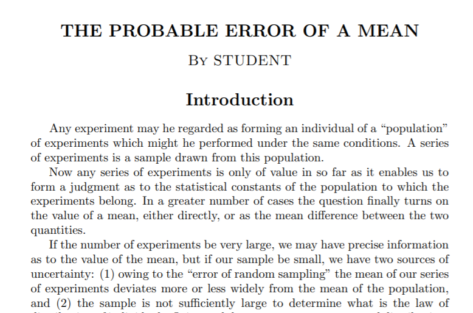

```{r setup, include=FALSE}
library(learnr)
# library(checkr)
# library(statPREP)
library(tibble)
library(ggformula)
library(mosaic)
#library(fastR)
#library(fastR2)
library(maxLik)
theme_set(theme_bw(base_size=16))
# knitr::opts_chunk$set(exercise.checker = checkr::checkr_tutor)
knitr::opts_chunk$set(
  echo = FALSE, warning = FALSE,
  fig.align = "center",
  fig.width = 6, fig.height = 2.5)
tutorial_options(exercise.eval = FALSE)


```

## Learning Outcomes

Our goal in this module will be to obtain the tools we need to be able to do hypothesis tests and compute confidence intervals for a **mean** or a **difference in means between two groups**, using a shortcut (the t model) to estimate the standard error of the required sampling distribution from *one data sample*. No resampling or simulation required!

By the end of the module you will:

1) Be able to quote the Central Limit Theorem for a mean, which says that the sampling distribution of a mean (if the sample size is big enough) is **normal**, with mean $\mu$ (the *population* mean) and standard deviation $\frac{\sigma}{\sqrt{n}}$ ($\sigma$ is the standard deviation of the *population*, and $n$ is the sample size).  For a difference between the means of two groups, the SE is $\sqrt{\frac{\sigma_1^2}{n_1} + \frac{\sigma_2^2}{n_2}}$ (where $\sigma_1$ and $\sigma_2$ are the population standard deviations of the two groups, and $n_1$ and $n_2$ are the sample sizes of the two groups)
2) Realize that, since we can't know $\sigma$ (the population standard deviation) in most practical cases, we'll have to use our best estimate of $\sigma$ -- the sample standard deviation $s$ -- to compute those standard errors. *This has consequences!*
3) Specifically, you'll be able to explain why using $s$ instead of $\sigma$ in those formulas affects the shape of the sampling distribution, turning it from a *normal* distribution to a *t distribution*.
4) You'll also be able to describe a t-distribution and how it differs from a normal distribution.
5) Finally, you will be able to use t-distributions to find CIs and do tests for means (and differences in means for paired data, or between two groups).

*These materials come from your text book, [Intro to Modern Statistics Chapter 19](https://openintro-ims.netlify.app/inference-one-mean.html#inference-one-mean). Book sections corresponding to parts of this tutorial will be linked throughout; you are encouraged but not required to read them before or after completing the tutorial.*

## Reminder: Central Limit Theorem

Let's take three minutes to review the main point of the Central Limit Theorem, this time with rabbits and dragons.

<iframe src="https://player.vimeo.com/video/75089338" width="640" height="360" frameborder="0" allow="autoplay; fullscreen" allowfullscreen></iframe>
<p><a href="https://vimeo.com/75089338">CreatureCast - Central Limit Theorem</a> from <a href="https://vimeo.com/user1747626">Casey Dunn</a> on <a href="https://vimeo.com">Vimeo</a>.</p>

To sum up:  The *sampling distribution* of a mean will be **normal**, if the sample size is big enough.  The bigger the sample size, the smaller the standard error (SE) will be. What was not mentioned in amongst the rabbits and dragons was *a specific expression for the SE of a mean*.

## SE for a Mean


It turns out that the SE for a mean is:

$$ SE = \frac{\sigma}{\sqrt{n}}$$

Where $\sigma$ is the standard deviation of the population distribution you're taking samples from, and $n$ is your sample size.

This kind of makes sense:  The spread of the sampling distribution will always be smaller than the spread of the sample, and it will get even smaller as sample size gets bigger.  

### Simulation

Let's look at a simulated example to picture this.  

**Run the code below to plot a parent population, a sample from that population of size $n$, and the sampling distribution of the mean. Change the value of $n$ in the code to see how it affects the sampling distribution.** *The rest of the code is shown for completeness, but you won't have to interpret or reproduce it.*


```{r mean-samp-dist-sim, exercise = TRUE, fig.width = 6, fig.height = 3, fig.align='center'}
n <- 50
nbins <- max(round(n/20), 5)
population <- rgamma(1000, shape = 3, rate = 0.5)
sample <- rgamma(n, shape = 3, rate = 0.5)
samp_dist <- rnorm(1000, mean = 6, sd = sqrt(12 / sqrt(n)))

gf_density(~population, color = 'grey44', fill = 'grey24') %>%
  gf_labs(x = 'Rabbit Weights (lbs)', y = 'Density') %>%
  gf_dhistogram(~sample, bins = nbins, color = "#0072B2", fill = "#0072B2") %>%
  gf_density(~samp_dist, color = "#D55E00", fill = "#D55E00") %>%
  gf_text(0.25 ~ 9, label = 'Population', color = 'grey44', hjust = 0) %>%
  gf_text(0.2 ~ 9, label = 'Sample', color = "#0072B2", hjust = 0) %>%
  gf_text(0.15 ~ 9, label = 'Sampling Distribution', color = "#D55E00", hjust = 0)
```


## SE for a Mean - For Real
*Text book reference: [IMS, "Introducing the t-distribution"](https://openintro-ims.netlify.app/inference-one-mean.html#introducing-the-t-distribution)*

Well, that's great.  But *we can't actually compute $\frac{\sigma}{\sqrt{n}}$!* If we have a sample...sure, we know what $n$ is. But $\sigma$ is the population standard deviation, which we *don't* know.

We'll have no choice but to use $s$, the standard deviation of our data, as an estimate of $\sigma$.  Will that be OK?  Well, it'll have to, since it's the only estimate we have! And we are pretty sure it will be great for really large $n$ -- we were told that $s$ was an unbiased estimator of $\sigma$, after all.

*But we should, perhaps, be worried about what happens for* **small $n$**.

Next, we'll do some simulations to see how using $s$ instead of $\sigma$ affects our estimated $SE$.

## Using $s$ for $\sigma$ - Large $n$

In the simulation below, we **control $\mu$ and $\sigma$**, the population parameters -- so unlike the usual real-life situation, we can know *both* the population $\mu$ and $\sigma$ and also the mean and sd ($\bar{x}$ and $s$) of a sample taken from that population.

Here, the true mean is $\mu = 0$ and the standard deviation is $\sigma = 1$. Our sample size is BIG: $n = 400$.

*So if we take lots of samples and find $s$ for each one, we should get* **1** *on average. The vertical black line show the true value of $\sigma = 1$, and the histogram shows values of $s$ from lots of samples.*

<details>
  <summary>Show code</summary>
```{r, t-dist-sim, echo = TRUE, eval = FALSE}
s_check <- do(1000)*sd(~rnorm(400, mean = 0, sd = 1))
gf_histogram(~sd, data=s_check) %>% 
  gf_vline(xintercept=1) %>%
  gf_labs(x='s (estimates of standard deviation)\n from samples of size 400')
```
</details>


```{r, ref.label = 't-dist-sim', eval = TRUE, echo = FALSE, fig.width = 6, fig.height = 3, fig.align='center'}

```

**What a relief! For big $n$, $s$ works great as an estimate of $\sigma$ - no problems at all.  Sometimes we get a sample that underestimates or overestimates, but on average, it's right.**


```{r small-n-effect}
quiz(question("What do you expect will happen when sample size is small?",
              answer("s will often be an underestimate.", correct = TRUE,
                     message = "Yes!  Smart thinking (or good guess). Continue to the next section to see the simulation that confirms your answer."),
              answer("s will often be an overestimate.",
                     message = "Nope...not quite. Continue to the next section to see the simulation and learn what actually happens!"),
              answer("s will still be correct on average.",
                     message = "Nope...not quite. Continue to the next section to see the simulation and learn what actually happens!"),
              random_answer_order = TRUE,
              allow_retry = TRUE
  )
)
```

## Using $s$ for $\sigma$ - Small $n$

In the simulation below, we **control $\mu$ and $\sigma$**, the population parameters -- so unlike the usual real-life situation, we can know *both* the population $\mu$ and $\sigma$ and also the mean and sd ($\bar{x}$ and $s$) of a sample taken from that population.

Again, the true mean is $\mu = 0$ and the standard deviation is $\sigma = 1$. Our sample size is now SMALL: $n = 4$.

*So if we take lots of samples and find $s$ for each one, we should get* **1** *on average. The vertical black line show the true value of $\sigma = 1$, and the histogram shows values of $s$ from lots of samples.*

<details>
  <summary>Show code</summary>
```{r, t-sim-2, echo = TRUE, eval = FALSE}
set.seed(13)
s_check <- do(1000)*sd(~rnorm(4, mean = 0, sd = 1))
gf_histogram(~sd, data=s_check) %>% 
  gf_vline(xintercept=1) %>%
  gf_labs(x='s (estimates of standard deviation)\n from samples of size 4')
```
</details>


```{r, ref.label = 't-sim-2', eval = TRUE, echo = FALSE, fig.width = 6, fig.height = 3, fig.align='center'}

```

**Shucks! For small $n$, $s$ works less well as an estimate of $\sigma$ - it is frequently an underestimate. (More than half of the area of the distribution is to the left of 1.)**
  
*Will this be a problem for us? Alas, yes. Let's see why.*

## Why we need the t-distribution
*Text book reference: still [IMS, "Introducing the t-distribution"](https://openintro-ims.netlify.app/inference-num.html#introducing-the-t-distribution)*

So...why is underestimating $\sigma$ just a little such a big problem that we need a whole new probability distribution? Let's see...

 { width=400px }
You can also [watch directly on YouTube](https://youtu.be/-cDJZYYMqRQ) if you prefer.

*Note: there's a tiny inconsistency between the text on my slides and my code. It doesn't obscure the main point, so I decided not to correct the video. But if any of you code-lovers spot it, email me! I'll give some homework extra credit for explaining the discrepancy.*

## Origins of the t-distribution
The distribution we now crave -- one that is like a standard normal distribution, but "squashed" -- was first described in 1908...

[{width=300px}](https://www.york.ac.uk/depts/maths/histstat/student.pdf)

By William Gosset, writing under the false name "A. Student". *(Optionally, click the image above to get a copy of his paper. You could plow through it if you were determined, and it is charmingly old-fashioned...)*

Let's learn a bit more about him and his work!

 { width=400px }
(Or [watch directly on YouTube if you want](https://www.youtube.com/watch?v=GFzCIA9kppM).)

## Interlude: Mr. T.
*Not in the text book...*

Hey...did you ever watch the old T.V. show "The A-Team"? Check out this short clip and keep your eye out for **Mr. T.'s character B.A. Baracus.** Think as you watch about words you could use to describe him.

 { width=400px }
(Or [watch directly on YouTube if you want](https://www.youtube.com/watch?v=Cn6kEsloMdE).)


```{r describe-mr-t}
quiz(question("How could you describe Mr. T?",
              answer("Small and gentle", message = "No...really? Not really, right?"),
              answer("Large, and perhaps violent.", correct = TRUE, message = "Yes. I'd say so too."),
              answer("Unassuming, just a guy who blends in.", message = "I'd actually say he wants to be noticed..."),
              random_answer_order = TRUE,
              allow_retry = TRUE)
  )
```

## Mr T.'s Secret Obsession
*Also not in the text book...*

Very few people know this (*probably because I made it up*), but Mr. T is the child of a biologist and a statistician. They taught him to **hate** sampling distributions of means for small sample sizes. The smaller the sample size, the more he hates them.  And what does he do?

He turns them from normal distributions into t-distributions, that's what.  So if you're ever trying to remember the difference between a normal and a t distribution, remember this image...

 { width=400px }
(Or [watch directly on YouTube if you want](https://youtu.be/LRhAeE-WgXQ).)

## Why it Matters
*Text book reference: [IMS section "Introducing the t-distribution"](https://openintro-ims.netlify.app/inference-one-mean.html#introducing-the-t-distribution)*

OK, so now we know a few things:

- We need to compute $\frac{s}{\sqrt{n}}$ to estimate the SE for a mean
- Our SE will be an *underestimate* when sample sizes are small, which will affect the sampling distribution
- The result of all this is that **we should (ALWAYS) use t distributions rather than normal distributions to find CIs or do tests for a mean**.

## Confidence Intervals for a Mean
*Text book reference: [IMS, "One sample t confidence intervals"](https://openintro-ims.netlify.app/inference-one-mean.html#one-sample-t-intervals)*

Before this, we have found CIs according to

$$ \text{sample stat} \pm z^* SE$$

Where $z^*$ is the "multiplier" *from a standard normal distribution* corresponding to our desired confidence level. We computed $z^*$ values with `qnorm()`; for example, for 99% confidence, we did:

```{r, echo = TRUE}
qnorm((1 - 0.99)/2, mean = 0, sd = 1, lower.tail = FALSE)
```

This was really nice because we only needed to compute the $z^*$ values *once* for each confidence level, store them in a handy table, and then use them at will.

**No more, alas.  To find a CI for a mean, we should use a t distribution (with n-1 degrees of freedom) instead of the normal. And we'll call our "multiplier" $t^*$ instead of $z^*$.  So to get a CI for a mean we compute:**

$$ \bar{x} \pm t^* SE$$

And we use the R function `qt()` to get the $t^*$ values. Its first input is [1 - (1 - C)/2] (where C is our desired confidence level), and we must also specify the degrees of freedom `df`.  We can also choose `lower.tail = TRUE` or `lower.tail = FALSE`, just like for `qnorm()`.

Since $t^*$ depends on sample size as well as confidence level, we will have to compute it *every problem* -- no more handy table, sorry!

### Example 1
For example, if we have a sample size of 15, that is 14 degrees of freedom. For 95% confidence, $t^*$ will be:

```{r, echo = TRUE}
qt(0.975, df = 14, lower.tail = FALSE)
```

Notice, because of the squashed-ness of the t-distribution compared to the normal, this $t^*$ is quite a bit **bigger**  than the corresponding $z^* = 1.96$!

### Example 2
Another example. What if our sample size is $n = 24$ and we want 98% confidence?

```{r, echo = TRUE}
qt(0.99, df = 23)
```


### Practice
Your turn...use this exercise block to run `qt()` to get the answers the the questions below.

```{r qt-calcs, exercise = TRUE}

```


```{r t-ci-quiz}
quiz(question("How do t* values compare to the corresponding z* values (for the same sample size and confidence level)?",
              answer("The t* values are always bigger, because of the squashed-ness of the t distribution compared to the normal.", correct = TRUE),
              answer("The t* values are always smaller, because of the squashed-ness of the t-distribution compared to the normal."),
              answer("Sometimes the t* is larger, and sometimes the z* is larger."),
              allow_retry = TRUE,
              random_answer_order = TRUE),
     question("Find the t* value you would use to find a 95% CI for the mean weight of 17 rabbits. The sample mean is 1.1 kg with standard deviation 0.3 kg.",
              answer("2.12", correct = TRUE),
              answer("2.11"),
              answer("1.96"),
              answer("1.75"),
              random_answer_order = TRUE,
              allow_retry = TRUE),
     question("Find the t* value you would use to find a 99% CI for the mean wingspan of 4 dragons, when the sample mean wingspan is 14.1m with a standard deviation of 2.2m.",
              answer("5.84", correct = TRUE),
              answer("4.60"),
              answer("2.58"),
              answer("4.54"),
              allow_retry = TRUE,
              random_answer_order = TRUE)
  )
```


**Other than the need to use a different multiplier** $t^*$ **instead of** $z^*$, **CIs for a mean are the same as before.**

### Dragons
So, to give a complete example, let's consider the dragons you answered a question about earlier, and find a 99% CI for the mean wingspan of 4 dragons, when the sample mean wingspan is 14.1m with a standard deviation of 2.2m.

First, we find 

$$ SE = \frac{s}{\sqrt{n}} = \frac{2.2}{\sqrt{4}} = 1.1$$

We also need the $t^*$ value for 3 degrees of freedom and 99% confidence:

```{r, echo = TRUE}
qt(0.995, df = 3)
```

Now, we find our CI according to

$$ \bar{x} \pm t^* SE = 14.1 \pm 5.84 * 1.1$$

The CI is (7.68, 20.52). We are 99% confident the true mean dragon wingspan is between 7.68 and 20.52 meters.

## Tests for a Mean
*Text book reference: [IMS, "Tests for a mean"](https://openintro-ims.netlify.app/inference-one-mean.html#one-sample-t-tests)*

We can also use t-distributions to do tests for a mean ("t-tests"). We will *always work with the * **standardized** *test statistic t*, and we'll use a t distribution with $n - 1$ degrees of freedom to compute our p-value, instead of a standard normal.

### Dragon Example
So, an example: what if we want to use those same dragon data to test the hypotheses:

$$H_0: \mu = 20$$
$$H_A: \mu \neq 20$$

First, we compute our test statistic $t$:

$$ t = \frac{(\bar{x} - \mu_0)}{\frac{s}{\sqrt{n}}} = \frac{(14.1 - 20)}{\frac{2.2}{\sqrt{4}}} = -5.364$$

Now, the p-value of our test will be twice the probability of getting a value at least as far from 0 as -5.364 is, in a t distribution with 3 degrees of freedom.

We can compute it using `pt()` (or `xpt()`, which is `x`tra cool because it also prints a sketch):

```{r, echo = TRUE}
xpt(-5.364, df = 3, lower.tail = TRUE) * 2
```

The p-value is pretty small -- 0.013. So we might reject the null hypothesis that the true mean wingspan is 20m -- based on our data, it's likely smaller than that.  

*(Notice that this conclusion contradicts our 99% CI, but it's just because there, we used 99% confidence; while here, we were willing to reject $H_0$ when the p-value was larger than 0.01!)*


## Paired Data

Sometimes, we are interested in comparing means between two groups, but we have *paired data*.  This means that each row of our dataset contains a *pair* of measurements: weights before and after a nutrition program, or weekly income before and after a job retraining program, or ... the idea is that the measurements come naturally in pairs.

(Soon, we'll consider comparing means with *unpaired* data -- just subdivided into two groups. For example, *unpaired* data might be something like: we measured the wingspans of 16 magic dragons and 12 muggle dragons; we want to know whether the mean wingspan of magic and muggle dragons is the same.)

The key here is to realize that in the *paired* data scenario, the sample stat of interest can be computed by subtracting the two observations *in each row* of the data to get a variable that gives a list of *differences* between the two groups/conditions; then taking the mean of the list of differences.  If we consider the column of differences to be "our dataset" -- the variable of which we want to find the mean -- then: **we have a one-mean problem just like the rabbits and dragons ones we just learned to do!** It's just that instead of "rabbit weight" or "dragon wingspan" each row of our data contains an observation of "difference between ...".

Practically, the only challenge here is *to recognize when you have paired data*. The mechanics of the CI or test are just the same.

Here's a video with some more examples of paired and unpaired data:

{ width=400px }
(Or [watch directly on YouTube](https://www.youtube.com/watch?v=byLVMnk9QuY).)

## Recap

Want a brief recap of everything just discussed -- in cartoon form?  You're in luck - here it is!

{ width=400px }
(Or [watch directly on YouTube](https://www.youtube.com/watch?v=32CuxWdOlow).)

## Conditions
*Text book reference: [IMS on conditions for the t model for a mean](https://openintro-ims.netlify.app/inference-one-mean.html#evaluating-the-two-conditions-required-for-modeling-barx)*

For the proportion tests/intervals, we had a bunch of conditions that had to hold in order to use the normal model "shortcut".

What about here?

**What conditions must hold to be able to use a t-test or a t confidence interval?**

Before doing a t-test or constructing a t confidence interval, it's important to verify that all the conditions below are met:

- The sample must be **representative** of the population of interest (as always)
- The cases must be **independent** (no lurking variables linking them)
- The sample size must be "big enough" *or* the data distribution must be "nearly normal". 
  - "big enough" -- if the sample size is larger than about 40, great.
  - "nearly normal" -- if the sample size is *smaller* than about 40, but the data look like they could be a sample from a normal population -- that is, the distribution is somewhat symmetric and unimodal and bell-shaped (no major skew, no extreme outliers), great. Sigh. With a sample size this small, it's super hard to tell, so as long as there is no major skew or extreme outliers, we will say it's okay.

## What about Two Means?

What about the case where we want to estimate a *difference in means* between two groups, and find a CI or do a test?

Sure, we can already do this with a bootstrap CI or a randomization test. But what about a shortcut?

Is it possible? *Certainly.* So why are we waiting until next week?

Right now, we've been doing a lot of the nuts and bolts of the calculations ourselves, finding SEs, sketching sampling distributions, finding $t^*$ values, etc.

That becomes less practical for a test or interval for a difference in means; the expression for the SE is a bit more complicated, and the expression to estimate the degrees of freedom for this scenario is even more so.  It becomes less useful to do the work "by hand" and more appealing to let R do all the number crunching; we just control what numbers we want it to crunch via our inputs to the function `t.test()`.

So later, we will learn to let R do all the work for tests for one and two proportion tests and CIs (using function `prop.test()`), and also for one mean, paired means, and two means (using function `t.test()`). So now you have something lovely to look forward to!
